<a href="https://signatureapi.com">
  <picture>
    <source media="(prefers-color-scheme: dark)" srcset="./assets/banner-dark.svg">
    
  </picture>
</a>

<p align="center">
  <a href="https://dashboard.signatureapi.com/sign-up"><picture><source media="(prefers-color-scheme: dark)" srcset="https://img.shields.io/badge/Start_free-fafafa?style=for-the-badge&labelColor=fafafa"></picture></a>
  <a href="https://signatureapi.com/docs/api/welcome"><picture><source media="(prefers-color-scheme: dark)" srcset="https://img.shields.io/badge/API_docs-3f3f46?style=for-the-badge&labelColor=3f3f46"></picture></a>
  <a href="https://signatureapi.com/docs/ai-toolkit/agents"><picture><source media="(prefers-color-scheme: dark)" srcset="https://img.shields.io/badge/AI_Toolkit-3f3f46?style=for-the-badge&labelColor=3f3f46"></picture></a>
  <a href="https://signatureapi.com/changelog"><picture><source media="(prefers-color-scheme: dark)" srcset="https://img.shields.io/badge/Changelog-3f3f46?style=for-the-badge&labelColor=3f3f46"></picture></a>
</p>

<br>

## Three ways to send for signature

<table>
  <tr>
    <td width="33%" valign="top">
      <h3>⌘&nbsp; API</h3>
      <p>Integrate electronic signatures into your app or platform. Define the entire signing workflow in one request.</p>
      <a href="https://signatureapi.com/docs/api/welcome"><b>Read the API docs →</b></a>
    </td>
    <td width="33%" valign="top">
      <h3>⚡&nbsp; No-code</h3>
      <p>Automate sending and tracking documents for signature from the tools your team already uses.</p>
      <a href="https://signatureapi.com/docs/integrations/power-automate/getting-started"><b>Power Automate</b></a> ·
      <a href="https://signatureapi.com/docs/integrations/zapier/overview"><b>Zapier</b></a>
    </td>
    <td width="33%" valign="top">
      <h3>✦&nbsp; AI Toolkit</h3>
      <p>Let your AI agent send and track signed documents through a hosted MCP server and agent skills.</p>
      <a href="https://signatureapi.com/docs/ai-toolkit/agents"><b>Connect your agent →</b></a>
    </td>
  </tr>
</table>

## Send your first envelope in one request

An **envelope** holds the documents to sign and the recipients who sign them. Sign up for a free test key, then run:

```bash
curl https://api.signatureapi.com/v1/envelopes \
  -H 'X-API-Key: key_test_xxxxxxxx' \
  -H 'Content-Type: application/json' \
  -d '{
        "title": "Dummy Consent",
        "documents": [{
          "url": "https://pub-9cb75390636c4a8a83a6f76da33d7f45.r2.dev/privacy-placeholder.pdf",
          "places": [{ "key": "signer_signs_here", "type": "signature", "recipient_key": "visitor" }]
        }],
        "recipients": [{
          "key": "visitor", "type": "signer",
          "name": "Jane Doe", "email": "jane@example.com"
        }]
      }'
```

Jane gets an email, signs in a clean, focused ceremony, and you get the signed PDF with its audit log, plus a webhook at every step. Test envelopes are free and have no legal effect. [Full quickstart →](https://signatureapi.com/docs/api/quickstart)

## Built for AI agents

Connect any MCP client to the hosted server. It signs in with OAuth, so no API key ever sits in a config file.

```text
https://mcp.signatureapi.com/mcp
```

<details open>
<summary><b>Claude Code:</b> install the plugin (MCP server plus skills that design, build and debug your integration)</summary>

```text
/plugin marketplace add signatureapi/skills
/plugin install signatureapi@signatureapi
```

</details>

<details>
<summary><b>Any coding agent:</b> configure every agent on your machine at once</summary>

```bash
npx -y add-mcp https://mcp.signatureapi.com/mcp -g
```

</details>

<details>
<summary><b>Codex</b></summary>

```bash
codex plugin marketplace add signatureapi/skills
codex plugin add signatureapi@signatureapi
codex mcp login signatureapi
```

</details>

Works with Claude, ChatGPT, Cursor, Codex, VS Code, Gemini CLI and more. [Connect your client →](https://signatureapi.com/docs/ai-toolkit/mcp/connecting-clients)

## Everything a signing workflow needs

<table>
  <tr>
    <td width="33%" valign="top"><b>👥 Multiple recipients</b><br><sub>Up to 10 signers per envelope.</sub></td>
    <td width="33%" valign="top"><b>🔀 Parallel or sequential</b><br><sub>Everyone at once, or one after another.</sub></td>
    <td width="33%" valign="top"><b>📚 Bundle documents</b><br><sub>Up to 10 documents in one envelope.</sub></td>
  </tr>
  <tr>
    <td valign="top"><b>🧩 Document templates</b><br><sub>Merge your data into DOCX templates.</sub></td>
    <td valign="top"><b>🔔 Real-time notifications</b><br><sub>Webhooks for every envelope event.</sub></td>
    <td valign="top"><b>🌐 Languages and localization</b><br><sub>Signers see the ceremony in their language.</sub></td>
  </tr>
  <tr>
    <td valign="top"><b>🙋 Accountless signing</b><br><sub>Signers never create an account.</sub></td>
    <td valign="top"><b>🎨 Your branding</b><br><sub>Your logo and colors in emails and ceremonies.</sub></td>
    <td valign="top"><b>🔏 Signed, sealed, delivered</b><br><sub>Sealed PDFs with a complete audit log.</sub></td>
  </tr>
</table>

## Legally binding. Built to be trusted.

**ESIGN Act** · **UETA** · **eIDAS SES** · **SOC 2** · **HIPAA** · **GDPR** · **CCPA**

Signatures are valid under the US ESIGN Act and UETA, the EU's eIDAS regulation, and recognized internationally.

## Simple, usage-based pricing

- **Test mode**: Free, for as long as you want
- **Standard**: $25/month, 100 envelopes included
- **Each additional envelope**: $0.25, and only completed envelopes count
- **Commitment**: None. Cancel anytime

[See pricing →](https://signatureapi.com/pricing)

## What customers say

> We needed a scalable solution for handling digital signatures in our SaaS platform, and SignatureAPI delivered. Their support is responsive, the documentation is solid, and integration was smooth.
>
> **Scott Terrell**, Founder & CEO, Solvrix

> Lien waivers used to be the choke-point in our disbursement process. SignatureAPI dropped straight into our stack and now waivers go out, get signed, and come back automatically in minutes.
>
> **Cameron Strong**, Co-Founder, Findlan

## Open source

| Repository | What it is |
| :-- | :-- |
| [**skills**](https://github.com/signatureapi/skills) | Agent skills for SignatureAPI: design, build and diagnose e-signature integrations |
| [**signatureapi-mobile-integration-demo**](https://github.com/signatureapi/signatureapi-mobile-integration-demo) | Embedded signing in native iOS (SwiftUI) and Android (Compose) apps |
| [**ceremony-embed-demo**](https://github.com/signatureapi/ceremony-embed-demo) | Embed a signing ceremony in your web app with an iframe |

<br>

<p align="center">
  <a href="https://signatureapi.com"><b>Website</b></a> ·
  <a href="https://signatureapi.com/docs/api/welcome"><b>Docs</b></a> ·
  <a href="https://signatureapi.com/blog"><b>Blog</b></a> ·
  <a href="https://signatureapi.com/changelog"><b>Changelog</b></a> ·
  <a href="mailto:support@signatureapi.com"><b>Support</b></a>
</p>
